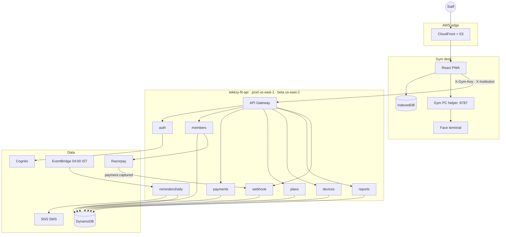
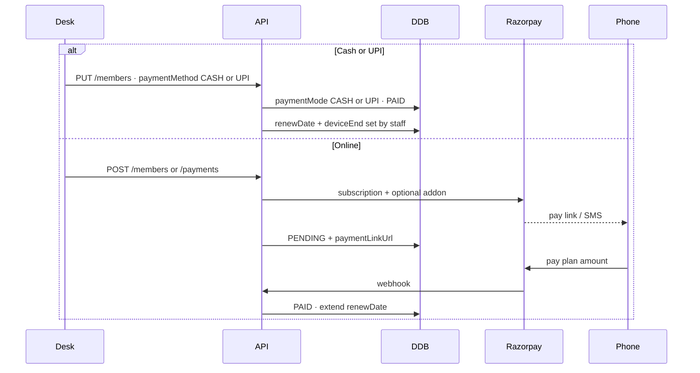

# Tekkzy Fit

Desk software for a gym that stays usable when the internet drops.

Staff enrol members, take cash / UPI / Razorpay payments, push faces to the terminal, and see who walked in. Cloud is the source of truth when online. IndexedDB and the gym PC keep the floor running when it is not.

| | Beta | Production |
| --- | --- | --- |
| App | [tekkzyfitgym.tekkzy.com](https://tekkzyfitgym.tekkzy.com) | [fitnessworld2.0.tekkzy.com](https://fitnessworld2.0.tekkzy.com) |
| API | `tekkzy-fit-api-dev` · us-east-2 | `tekkzy-fit-api-prod` · us-east-1 |
| Razorpay | Test | Live |
| Institution | `Fitnessworld001` | `Fitnessworld001` |

---

## What it does

- **Members** — add, edit, pause, enrol face / finger / card on the terminal
- **Plans** — monthly and other cycles, admission add-on
- **Payments** — cash and UPI at the desk, or Razorpay subscription links
- **Attendance** — unique check-in days this month, refreshed on the members list
- **Reports** — cash / UPI / Razorpay totals, reimbursements
- **Reminders** — EventBridge at 04:00 IST, SMS two days before expiry
- **Staff login** — Amazon Cognito (`admin@tekkzy.com` and other gym accounts)

---

## System design



### How a request is trusted

The browser never talks to DynamoDB or Razorpay. Every cloud call goes through API Gateway with:

- `X-Gym-Key` — shared gym key from `.env.beta` / `.env.production`
- `X-Institution` — `Fitnessworld001`
- `Authorization` — Cognito id token after login

Razorpay secrets, Cognito pool ids, and AWS keys stay on Lambda / `cloud/.env`.

### Runtime split

| Layer | Role | Offline |
| --- | --- | --- |
| React + Vite PWA | Desk UI | Reads IndexedDB |
| Express helper `:8787` | Talks to the face terminal on LAN | Required for enrol / logs |
| Serverless API | Members, pay, plans, reports, auth | Queued, flushed when back |
| DynamoDB | Profiles, payments, monthly reports | Cloud only |
| Cognito | Staff users and groups | Login needs network |
| Razorpay | Subscriptions and webhooks | Online pay only |
| SNS + EventBridge | Expiry SMS at 04:00 IST | Cloud job |

Identity on the floor is the **device enrol id**, not a Cognito member account. Website members and terminal users are matched on that id.

### Payment paths



- **Cash / UPI** — collected at the desk, staff can set the end date, no Razorpay link.
- **Online** — Razorpay subscription. New members may pay an admission addon. Expiry reminders charge the **plan amount** now and schedule the next cycle on the current end date (so a ₹1700 monthly does not show as ₹5).
- A full reminder payment moves the end date forward one plan period. A ₹5 auth charge does not.

### Daily job

EventBridge `cron(0 4 * * ? *)` Asia/Kolkata → `remindersDaily`:

1. Snapshot the monthly report.
2. SMS anyone whose `renewDate` / `deviceEnd` is **today + 2 days**.
3. Cancelled / offline / pending members get a fresh pay link. Active members get a keep-balance message.

---

## Database design

Single-table style per gym. Partition key is the institution. Special `cognitoId` prefixes store non-member rows in the same profile table.

```mermaid
erDiagram
  INSTITUTION ||--o{ PROFILE : "institution"
  INSTITUTION ||--o{ PAYMENT : "institution GSI"
  INSTITUTION ||--o{ REPORT : "institution"
  INSTITUTION ||--|| GYM_PROFILE : "institutionid + index 0"

  PROFILE ||--o{ PAYMENT : "cognitoId"
  PROFILE ||--o| PLAN_ROW : "cognitoId __plan_"
  PROFILE ||--o| BRIDGE : "cognitoId __devicebridge__"

  PROFILE {
    string institution PK
    string cognitoId SK
    string userType
    string userName
    string phoneNumber
    string emailId
    string deviceEnrollId
    string planId
    number amount
    string paymentStatus
    string paymentMethod
    string subscriptionStatus
    string renewDate
    map attendance
    map attendanceDays
  }

  PAYMENT {
    string cognitoId PK
    string paymentId SK
    string institution
    number paymentDate
    string paymentMode
    string paymentStatus
    number amount
    string renewDate
  }

  REPORT {
    string institution PK
    string cognitoIdAndMonth SK
    number cashPayment
    number upiPayment
    number razorpayPayment
    number totalAttendance
  }

  GYM_PROFILE {
    string institutionid PK
    string index SK
    string companyName
  }
```

### Tables by stage

| Purpose | Beta (dev) | Prod | Keys |
| --- | --- | --- | --- |
| Members, plans, device bridge | `beta_user_profile` us-east-2 | `user_profile` us-east-1 | PK `institution` · SK `cognitoId` |
| Receipts | `beta_payment` us-east-2 | `payment` us-east-1 | PK `cognitoId` · SK `paymentId` |
| Monthly snapshot | `beta_monthly_report` us-east-2 | `monthly_report` us-east-1 | PK `institution` · SK `cognitoIdAndMonth` |
| Gym name / settings | `beta_code_generator_variables` us-east-2 | `code_generator_variables` us-east-1 | PK `institutionid` · SK `index` |

Indexes used by the API:

| Table | Index | Access |
| --- | --- | --- |
| Profile | `emailId-cognitoId-index` | Look up by email |
| Payment | `institution-paymentDate-index` | Gym payment history, newest first |
| Payment | `paymentDate-index` | Cross-gym date queries |

### Profile `cognitoId` reserved rows

| Prefix / id | `userType` | Meaning |
| --- | --- | --- |
| member uuid / `gym-…` | `member` | A person |
| `__plan_{planId}` | `plan` | Price, days, billing period |
| `__devicebridge__` | `device-bridge` | Terminal link state |
| `__devicecmd_…` | command | Outbound device job |
| `__deviceres_…` | result | Device job result |

Member fields the desk cares about:

| Field | Meaning |
| --- | --- |
| `deviceEnrollId` | Terminal user id — the real identity |
| `renewDate` / `deviceEnd` | Membership due date |
| `paymentMethod` | `CASH` · `UPI` · Razorpay |
| `subscriptionStatus` | `ACTIVE` · `PAUSED` · `CANCELLED` · `PENDING` · `OFFLINE` |
| `paymentLinkUrl` | Open Razorpay page, if any |
| `attendance` | `{ "September-2026": 12 }` unique days |
| `attendanceDays` | `{ "2026-09-10": true }` day set |
| `expiryReminderOn` | Date the 04:00 SMS already went out |

### Payment row

| Field | Cash / UPI | Razorpay |
| --- | --- | --- |
| `paymentId` | `off_…` | `pay-…` |
| `paymentMode` | `CASH` or `UPI` | `RAZORPAY` |
| `paymentStatus` | `PAID` immediately | `PENDING` → `PAID` on webhook |
| `amount` / `netAmount` | Desk amount | Net after Razorpay fee |
| `renewDate` | Staff-set end date | Cycle end after a real charge |

Reports split the month into **cash**, **UPI**, and **Razorpay** so desk UPI is not counted as online.

---

## Repo layout

```
src/                 Desk UI
shared/              Types and access rules
server/              Local Express helper (terminal + fallback)
cloud/               Serverless API (separate git remote)
.github/workflows/   frontend-beta.yml · frontend-prod.yml
.env.beta            Beta Vite config + gym key
.env.production      Prod Vite config + gym key
```

Frontend remote: `tekkzy-fit-frontend` (`beta` / `prod`).  
API remote: `tekkzy-fit-backend` (`beta` / `prod`).

---

## Local

```bash
npm install
npm run dev
```

- UI: http://localhost:5173
- Helper: http://127.0.0.1:8787/api/health

Copy `.env.example`. For a cloud-backed desk, point `VITE_API_URL` at the beta or prod API and set `VITE_GYM_API_KEY` in `.env.beta` / `.env.production`.

```bash
npm run typecheck
npm run build:beta
npm run build:prod
```

API (from `cloud/`):

```bash
npx serverless deploy --stage dev
npx serverless deploy --stage prod
```

Do not commit `cloud/.env`, Razorpay keys, or Cognito secrets.

---

## API surface

| Path | Use |
| --- | --- |
| `POST /auth/login` | Cognito staff session |
| `ANY /members` · `/members/{id}` | Members, desk pay, pause / resume |
| `ANY /payments` · `/payments/{id}` | History and online links |
| `POST /webhooks/razorpay` | Capture / invoice / subscription |
| `ANY /plans` · `/plans/{id}` | Membership plans |
| `ANY /devices/{proxy+}` | Terminal bridge |
| `ANY /settings` | Gym settings |
| `ANY /reports/monthly` | Monthly snapshot |
| `POST /reminders/run` | Manual expiry SMS |
| `ANY /sync/push` · `/sync/pull` | Offline queue |

---

## Deploy

Push `beta` or `prod` on the frontend repo. GitHub Actions builds with the matching env file and syncs S3 + CloudFront.

| Branch | Bucket | CloudFront |
| --- | --- | --- |
| `beta` | `tekkzyfitgym.tekkzy.com` | `E1OCBE11AOPQ4W` |
| `prod` | `fitnessworld2.0.tekkzy.com` | `E10UQR06PAY9QF` |
